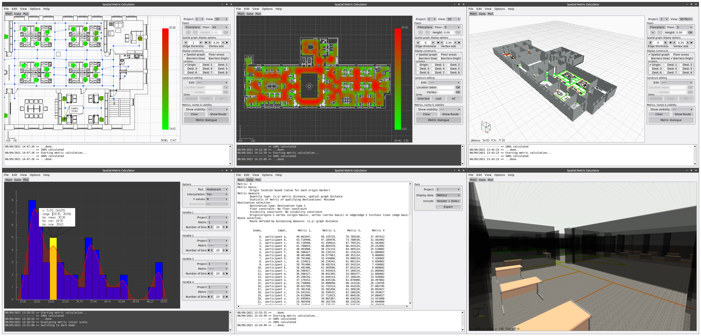

Spatial Metric Calculator is a research software tool for performing *code-free* graph analyses and visualisation. 

It is built to:

1. Design, import, edit, and visualise undirected graphs that primarily represent (but are not restricted to) spatial movement within interior spaces (e.g. offices).
2. Allow the user to automate and/or leverage DXF files in aspects of the design process.
3. Let the user specify key locations on that graph for the purposes of graph and visibility analyses.
4. Calculate and visualise a variety of centrality, path, and distance based metrics (based on Euclidean, graph, angular deviation, # turns etc. distance measures), with customisable destination, routing and visibility dependencies.
5. Export any metrics that have been generated as comma separated plain text files.
6. Allow for visualisation of metrics (in 2 and 3 dimensions) and basic plotting & comparison both between metrics and across distinct projects.

This program utilises [FLTK](http://www.fltk.org/index.php) to achieve GUI functionality and multi-platform support. 

## Getting started

Are you a Windows, Mac or Linux user? Then you can simply download the pre-compiled executables found in the [releases pages](https://github.com/rspinney/Spatial-Metric-Calculator/releases/latest/) of the repository and get started straight away! The current version is v1.4.1. Note, your machine must have a working OpenGL implementation for Spatial Metric Calculator to function.

## Examples

Example project files can be found in the [releases pages](https://github.com/rspinney/Spatial-Metric-Calculator/releases/latest/) of the repository.

## Documentation

A PDF user manual can be downloaded from the [releases pages](https://github.com/rspinney/Spatial-Metric-Calculator/releases/latest/) of the repository.

## Installation instructions

Whilst most users are encouraged to download the provided [pre-compiled executables](https://github.com/rspinney/Spatial-Metric-Calculator/releases/latest/), you may compile your own version if they are unsuitable.

Before doing so note that Spatial Metric Calculator has the following dependencies:

1. [FLTK](http://www.fltk.org/index.php) (v1.3.7 or later) for GUI functionality, used under the [FLTK license](https://github.com/rspinney/Spatial-Metric-Calculator/blob/master/docs/opensource_licenses/FLTK_license.txt).
2. [Boost](http://www.boost.org/) (v1.77 or later) for serialization and other small utility functions, used under the [Boost license](https://github.com/rspinney/Spatial-Metric-Calculator/blob/master/docs/opensource_licenses/Boost_license.txt).

Provided Boost has been installed, and FLTK has been built and installed using CMake on your system, an executable can also be built using CMake with the provided `CMakeLists.txt` script.

On Unix style systems, this is achieved by simply typing 

`mkdir build && cd build && cmake .. && make`

from the repository directory. Detailed instructions for compiling under Unix style systems can be found [here](https://github.com/rspinney/Spatial-Metric-Calculator/blob/master/docs/compilation_instructions/unix_compilation_instructions.txt).

## License

This software is distributed here under a public [Academic License](https://github.com/rspinney/Spatial-Metric-Calculator/blob/master/LICENSE). It guarantees free use to use, adapt, and distribute this software under its terms for academic, teaching, and personal use.

## Attribution and Funding

If this software was useful in the course of your research please consider citing it. Various citation formats can be downloaded by clicking [here](https://zenodo.org/badge/latestdoi/411694209) or on the following DOI badge. 

The development of this software was funded in part by the National Institute for Health Research's School for Public Health Research (NIHR SPHR).
